# 坎帕斯前端学院 
***
## 学习笔记
### 通信与信息工程学院  谌放  2016210574

* QQ：575923486 
* 邮箱：[**@小丑的独角戏台**](https://mail.qq.com/cgi-bin/frame_html?sid=3cMc4wafMGNvDix1&r=db865c2e4d244aa94e56a0ca229d3f9c)
* Github：[**@C-Fun**](https://github.com/C-Fun)
***

#Flex布局

###Flex是Flexible Box的缩写，意为”弹性布局”，用来为盒状模型提供最大的灵活性。
###任何一个容器都可以指定为Flex布局。
 
	.box{
		display:flex;
	}

行内元素也可以使用Flex布局

	.box{
		display:inline-flex;
	}

Webkit内核的浏览器，必须加上-webkit前缀

	.box{
		display:-webkit-flex;
		display: flex;
	}

***设为Flex布局以后，子元素的float,clear和vertical-align属性将会失效***

##基本概念

###采用Flex布局的元素，称为Flex容器（flex container），简称”容器”。它的所有子元素自动成为容器成员，称为Flex项目（flex item），简称”项目”。

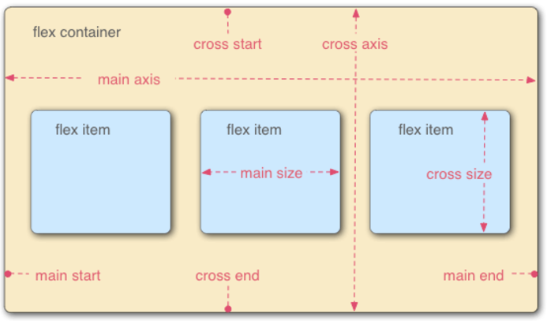

**容器默认存在两根轴：水平的主轴（main axis）和垂直的交叉轴（cross axis）。主轴的开始位置（与边框的交叉点）叫做main start，结束位置叫做main end；交叉轴的开始位置叫做cross start，结束位置叫做cross end。
项目默认沿主轴排列。单个项目占据的主轴空间叫做main size，占据的交叉轴空间叫做cross size。**

##容器的属性

有以下6个属性设置在容器上

> 
  <li>flex-direction</li>
  <li>flex-wrap</li>
  <li>flex-flow</li>
  <li>justify-content</li>
  <li>align-items</li>
  <li>align-content</li>

###flex-direction属性

flex-direction属性决定主轴的方向（即项目的排列方向）

	.box{
		flex-direction: row | row-reverse | column | column-reverse;
	}

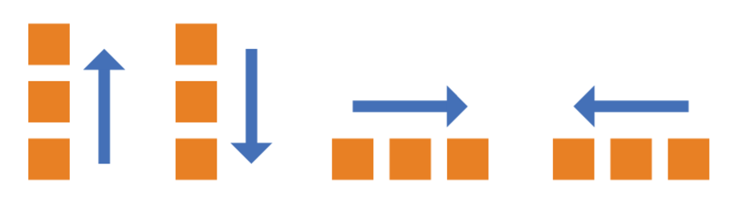

它可能有4个值。
> 
  <li>row（默认值）：主轴为水平方向，起点在左端。</li>
  <li>row-reverse：主轴为水平方向，起点在右端。</li>
  <li>column：主轴为垂直方向，起点在上沿。</li>
  <li>column-reverse：主轴为垂直方向，起点在下沿。</li>

###flex-wrap属性

默认情况下，项目都排在一条线（又称”轴线”）上。flex-wrap属性定义，如果一条轴线排不下，如何换行

	.box{
		flex-wrap: nowrap | wrap | wrap-reverse;
	}

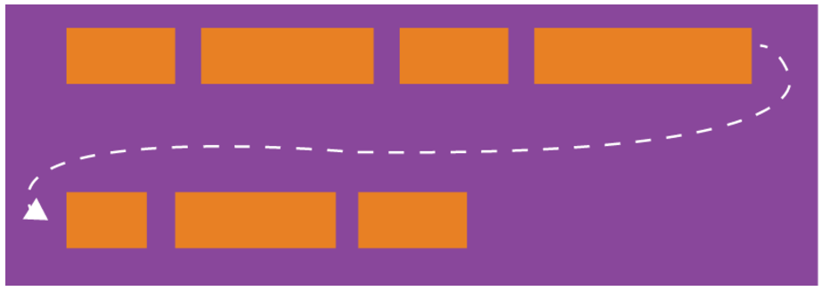

它可能取三个值。

<li>nowrap（默认）：不换行。</li>

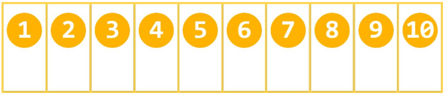

<li>wrap：换行，第一行在上方。</li>

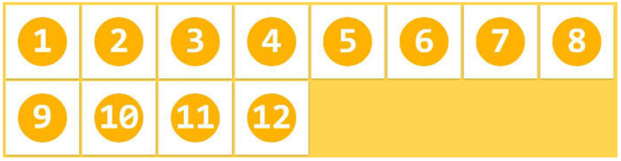

<li>wrap-reverse：换行，第一行在下方。</li>

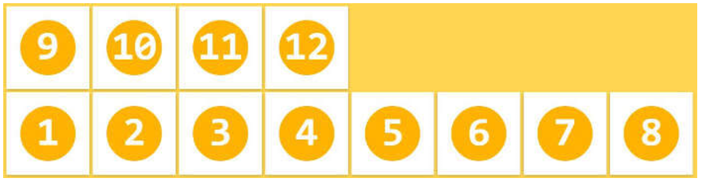

###flex-flow

flex-flow属性是flex-direction属性和flex-wrap属性的简写形式，默认值为row nowrap。

	.box {
	  flex-flow: <flex-direction> || <flex-wrap>;
	}

###justify-content属性

justify-content属性定义了项目在主轴上的对齐方式。

	.box {
	  justify-content: flex-start | flex-end | center | space-between | space-around;
	}

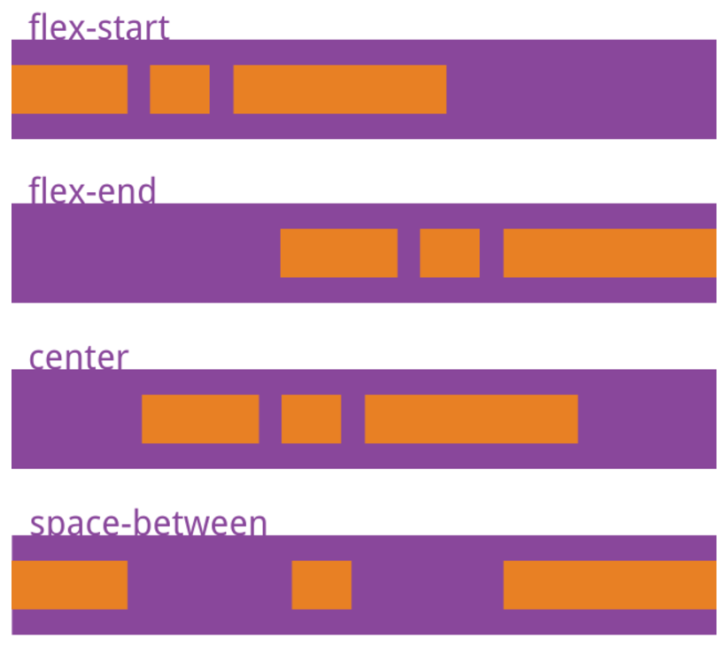

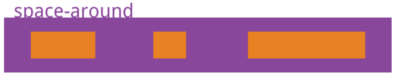

它可能取5个值，具体对齐方式与轴的方向有关。下面假设主轴为从左到右。

> 
  <li>flex-start（默认值）：左对齐</li>
  <li>flex-end：右对齐</li>
  <li>center： 居中</li>
  <li>space-between：两端对齐，项目之间的间隔都相等。</li>
  <li>space-around：每个项目两侧的间隔相等。所以，项目之间的间隔比项目与边框的间隔大一倍。</li>

###align-items属性

align-items属性定义项目在交叉轴上如何对齐。

	.box {
	  align-items: flex-start | flex-end | center | baseline | stretch;
	}

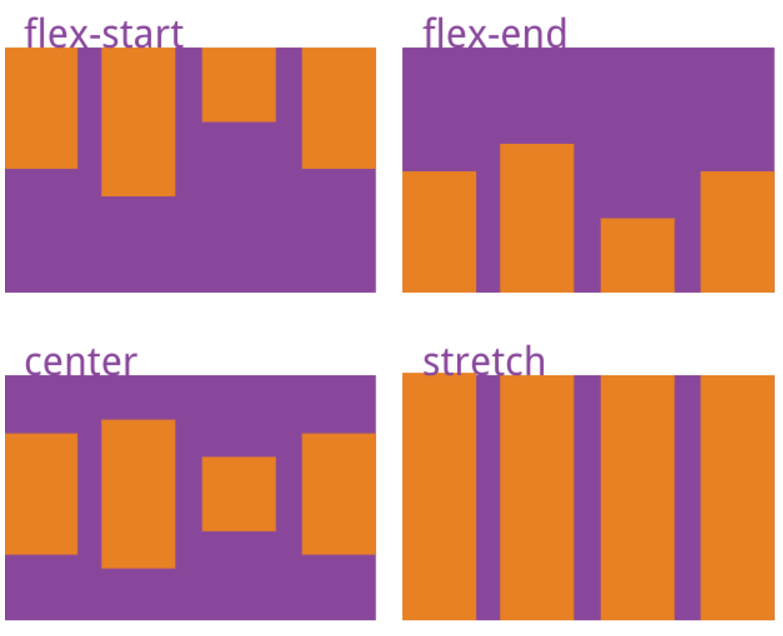

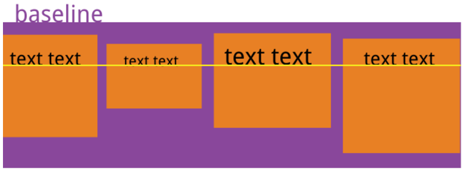

它可能取5个值。具体的对齐方式与交叉轴的方向有关，下面假设交叉轴从上到下。

> 
  <li>flex-start：交叉轴的起点对齐。</li>
  <li>flex-end：交叉轴的终点对齐。</li>
  <li>center：交叉轴的中点对齐。</li>
  <li>baseline: 项目的第一行文字的基线对齐。</li>
  <li>stretch（默认值）：如果项目未设置高度或设为auto，将占满整个容器的高度。</li>

###align-content属性

align-content属性定义了多根轴线的对齐方式。如果项目只有一根轴线，该属性不起作用。

	.box {
	  align-content: flex-start | flex-end | center | space-between | space-around | stretch;
	}

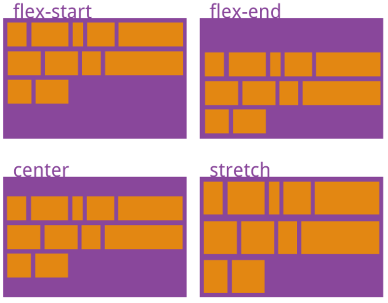

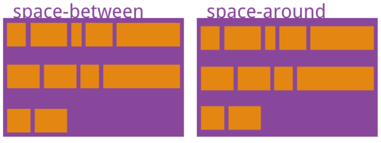

该属性可能取6个值。

>
  <li>flex-start：与交叉轴的起点对齐。</li>
  <li>flex-end：与交叉轴的终点对齐。</li>
  <li>center：与交叉轴的中点对齐。</li>
  <li>space-between：与交叉轴两端对齐，轴线之间的间隔平均分布。</li>
  <li>space-around：每根轴线两侧的间隔都相等。所以，轴线之间的间隔比轴线与边框的间隔大一倍。</li>
  <li>stretch（默认值）：轴线占满整个交叉轴。</li>

##项目的属性

以下6个属性设置在项目上

<li>order</li>
<li>flex-grow</li>
<li>flex-shrink</li>
<li>flex-basis</li>
<li>flex</li>
<li>align-self</li>

###order属性

order属性定义项目的排列顺序。数值越小，排列越靠前，默认为0。

	.item {
	  order: <integer>;
	}

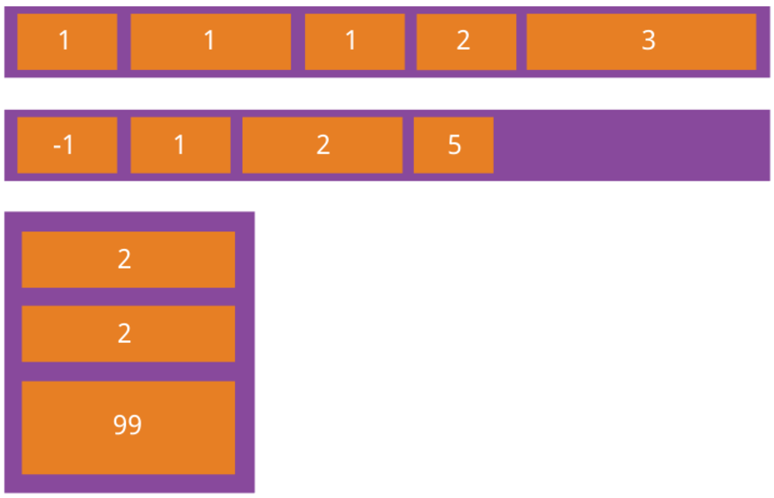

###flex-grow属性

flex-grow属性定义项目的放大比例，默认为0，即如果存在剩余空间，也不放大。

	.item {
	  flex-grow: <number>; /* default 0 */
	}

如果所有项目的flex-grow属性都为1，则它们将等分剩余空间（如果有的话）。如果一个项目的flex-grow属性为2，其他项目都为1，则前者占据的剩余空间将比其他项多一倍。

###flex-shrink属性

flex-shrink属性定义了项目的缩小比例，默认为1，即如果空间不足，该项目将缩小。

	.item {
	  flex-shrink: <number>; /* default 1 */
	}

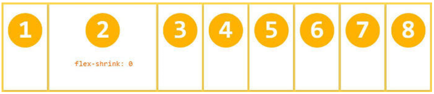

如果所有项目的flex-shrink属性都为1，当空间不足时，都将等比例缩小。如果一个项目的flex-shrink属性为0，其他项目都为1，则空间不足时，前者不缩小。
负值对该属性无效。

###flex-basis属性

flex-basis属性定义了在分配多余空间之前，项目占据的主轴空间（main size）。浏览器根据这个属性，计算主轴是否有多余空间。它的默认值为auto，即项目的本来大小。

	.item {
	  flex-basis: <length> | auto; /* default auto */
	}

它可以设为跟width或height属性一样的值（比如350px），则项目将占据固定空间。

###flex属性

flex属性是flex-grow, flex-shrink 和 flex-basis的简写，默认值为0 1 auto。后两个属性可选。

	.item {
	  flex: none | [ <'flex-grow'> <'flex-shrink'>? || <'flex-basis'> ]
	}

该属性有两个快捷值：auto (1 1 auto) 和 none (0 0 auto)。
建议优先使用这个属性，而不是单独写三个分离的属性，因为浏览器会推算相关值。

###align-self属性

align-self属性允许单个项目有与其他项目不一样的对齐方式，可覆盖align-items属性。默认值为auto，表示继承父元素的align-items属性，如果没有父元素，则等同于stretch。

	.item {
	  align-self: auto | flex-start | flex-end | center | baseline | stretch;
	}

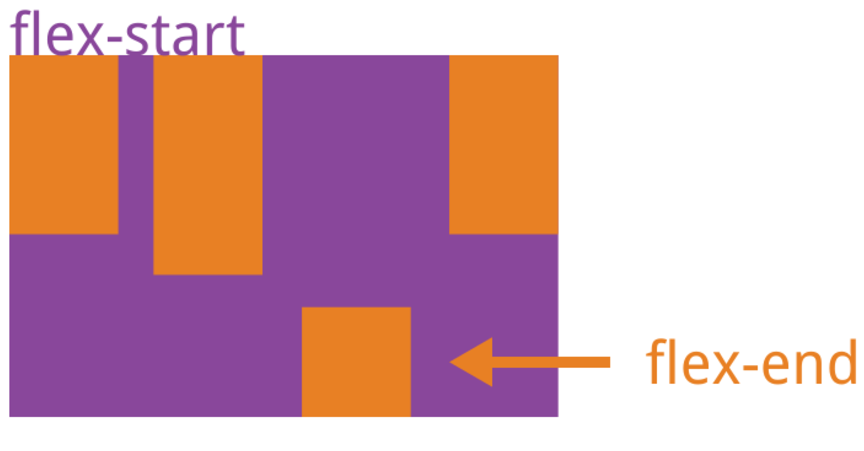

该属性可能取6个值，除了auto，其他都与align-items属性完全一致。