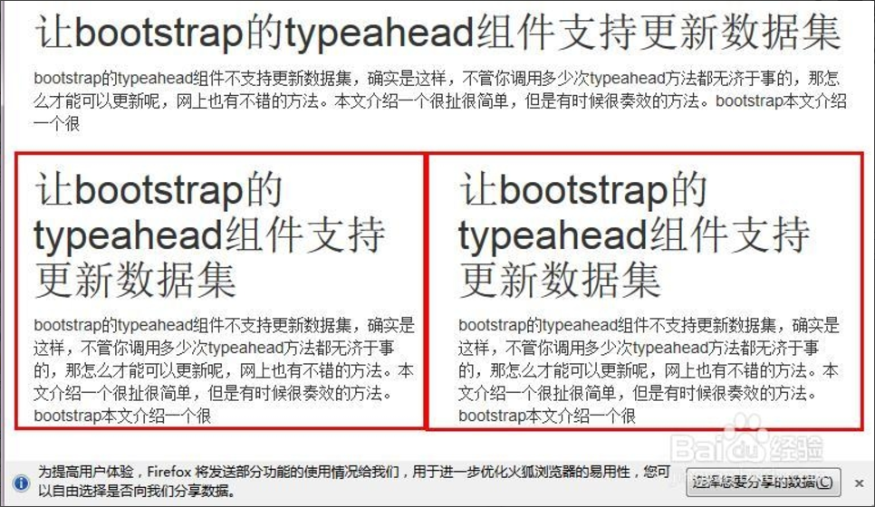
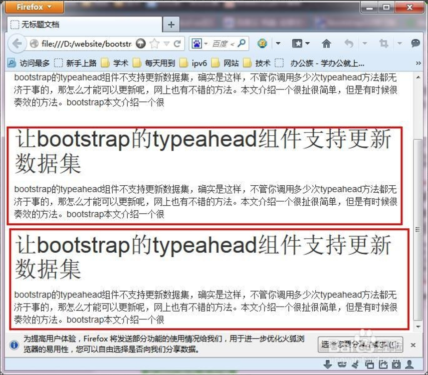
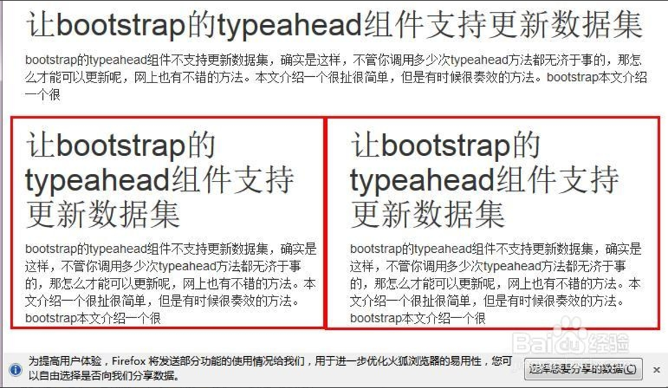
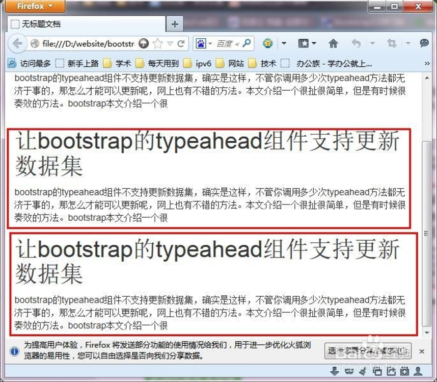

# 坎帕斯前端学院 
***
## 学习笔记
### 通信与信息工程学院  谌放  2016210574

* QQ：575923486 
* 邮箱：[**@小丑的独角戏台**](https://mail.qq.com/cgi-bin/frame_html?sid=3cMc4wafMGNvDix1&r=db865c2e4d244aa94e56a0ca229d3f9c)
* Github：[**@C-Fun**](https://github.com/C-Fun)
***

# 响应式网格(格栅化)布局

## 格栅系统详解

bootstrap3.0使用了四种栅格选项来形成栅格系统，其实区别只有一条，就是适合不同尺寸的屏幕设备。

class前缀这一项，以前缀命名这四种栅格选项，他们分别是col-xs ,col-sm,col-md,col-lg。

lg是large的缩写，md是mid的缩写，sm是small的缩写，xs是***的缩写。

* col-xs类，用法是
。星号代表1--12的数字。栅格系统总共有12列，这里使用数字几就代表着该div占用几列的宽度。假如在给超级小屏幕开发界面，那么当使用该类时，该类没有任何行为，不管屏幕小到多少，都不会改变div的布局。

* col-sm类，用法是
。该类适合屏幕宽度为750的设备，如果在屏幕宽度小于750的设备上，该div就会水平堆叠。
 * 这是在超过750屏幕上的样式：
 
 * 这是在低于750屏幕上的样式：
 

* col-md类：该类适合970像素以上屏幕。假如使用屏幕尺寸小于970像素的设备查看网页，div就会垂直堆叠。
 * 这是大于970像素的设备：
 
 * 这是小于970像素的设备：
 

* col-lg：使用方法跟前面一样，不赘述。

## 响应式网页设计

响应式网页设计（Responsive web design，缩写为RWD），或称自适应网页设计、回应式网页设计、对应式网页设计。是一种网页设计的技术方法，该设计可使网站在多种浏览器设备（从桌面电脑显示器到移动电话或其他移动产品设备）上阅读和导航，同时减少缩放、平移和滚动。

采用RWD设计的网站，使用CSS3 Media queries，流式的基于比例的网络和自适应大小的图像以适应不同大小的设备。

**流式网络概念**要求页面元素使用相对单位如百分比，或字体排印学调整大小，而不是绝对的单位如像素或点。（可先用像素排版，再用元素大小/容器大小计算百分比）。

**灵活的图像**也以相对单位调整大小（最大到100%），以防止它们显示在包含他们的元素之外。

**Media queries**，允许网页根据访问站点设备的特点而使用不同CSS样式规则，最常用的是浏览器的宽度。

## CSS3 media Rule

@media rule用于定义不同类型或设备媒体的展示规则。在CSS2中，这被称为media types，在CSS3中被称为media queries。

Media queries查询设备能力，可以查出很多内容，比如：视口的长宽，设备长宽，方向（手机是在风景模式还是肖像模式），解析度等

CSS 语法：

@media not|only mediatype and (media feature) {
    CSS-Code;
}

也可对不同媒体使用不同样式表

<link rel="stylesheet" media="mediatype and|not|only (media feature)" href="mystylesheet.css">

### Media Types

* all:用于所有类型设备

* print:用于打印机

* screen：用于电脑显示屏，平板，手机等。

### Media Features

* any-hover：是否有任何可用的输入机制允许用户将鼠标悬停在元素上？

* any-pointer：任何可用的输入机制是指向设备，如果是，它是多么准确？

* aspect-ratio：视口的宽高比。

* color：输出设备每个颜色的bit数。

* color-index：设备可展示的颜色数。

* grid：设备是灰度还是位图。

* height：视口高度。

* hover：主要的输入机制是否允许用户将鼠标悬停在元素上。

* inverted-colors：浏览器或底层操作系统是否反色。

* light-level：当前环境光级别。

* max-aspect-ratio：展示区域的宽高最大比。

* max-color：输出设备每个颜色的最大bit数。

* max-color-index：设备可展示的最多颜色数。

* max-device-aspect-ratio：设备最大宽高比。

* max-device-height：设备最大高度，例如电脑屏幕。

* max-device-width：设备最大宽度，例如电脑屏幕。

* max-height：展示区域最大高度，例如浏览器窗口。

* max-monochrome：在单色或灰度设备上每个颜色的最大bit数。

* max-resolution：设备最大分辨率，使用dpi或dpcm。

* max-width：展示区域的最大宽度，例如浏览器窗口。

* min-aspect-ratio：展示区域最小宽高比。

* min-color：输出设备每个颜色最少bit数。

* min-color-index：设备可展示的最小颜色数。

* min-device-aspect-ratio：设备最小宽高比。

* min-device-width：设备最小宽度，比如电脑屏幕。

* min-device-height：设备最小高度，比如电脑屏幕。

* min-height：展示区域最小高度，比如浏览器窗口。

* min-monochrome：在单色或灰度设备上每个颜色的最小bit数。

* min-resolution：设备最小分辨率，使用dpi或dpcm。

* min-width：展示区域最小宽度，比如浏览器窗口。

* monochrome：单色或灰度设备每个颜色的bit数。

* orientation：视口的方向（风景模式或肖像模式）
 
* overflow-block：输出设备如何处理沿着块轴溢出视口的内容。

* overflow-inline：可以滚动沿着内联轴溢出视口的内容。
 
* pointer：主要的输入机制是指向设备，如果是，它是多么准确？

* resolution：输出设备分辨率，使用dpi或dpcm。

* scan：输出设备的扫描过程。

* scripting：scripting（比如javascript）是否可用。

* update-frequency：输出设备可以多快修改内容的外观。

* width：视口宽度。

## HTML <link>标签media属性

Media属性指定不同媒体类型使用哪一个CSS样式表。

### 语法

<link media="value">

### 可用操作符

* and : and操作符

* not : not操作符

* , : or操作符

### 设备

* all:默认值，用于所有设备

* print:用于打印预览模式或打印的纸张。

* screen：用于电脑屏幕，平板或智能手机等。

* speech：用于“读取”页面的屏幕阅读器。

### 值

* aspect-ratio：指定目标展示区域的宽高比。使用“min-”和“max-”像素。
> example: media="screen and (max-aspect-ratio:16/9)"

* color：指定每个颜色的bit数。
> example: media="screen and (min-color:3)"

* color-index：颜色数。
> example: media="screen and (min-color-index:256)"

* grid：指定展示设备是网格还是位图。“1”代表网格，“0”代表其他。
> example: media="handheld and (grid:1)"

* height：制定展示区域高度。使用“min-”和“max-”像素。
> example: media="screen and (max-height:700px)"

* monochrome：指定单色帧缓冲区中每个像素的位数。使用“min-”和“max-”像素。
> example: media="screen and (min-monochrome:2)"

* orientation：指定展示目标或纸张的方向。可取值为：“portrait”或“landscape”。 
> example: media="all and (orientation: landscape)"

* resolution：指定显示目标或纸张的像素密度（dpi或dpcm）。使用“min-”和“max-”像素。
> example: media="print and (min-resolution:300dpi)"

* scan：指定tv的扫描方法。可取值为：“progressive”和“interlace”。
> example: media="tv and (scan:interlace)"

* width：指定目标展示区域的宽度。使用“min-”和“max-”像素。
> example: media="screen and (min-width:500px)"